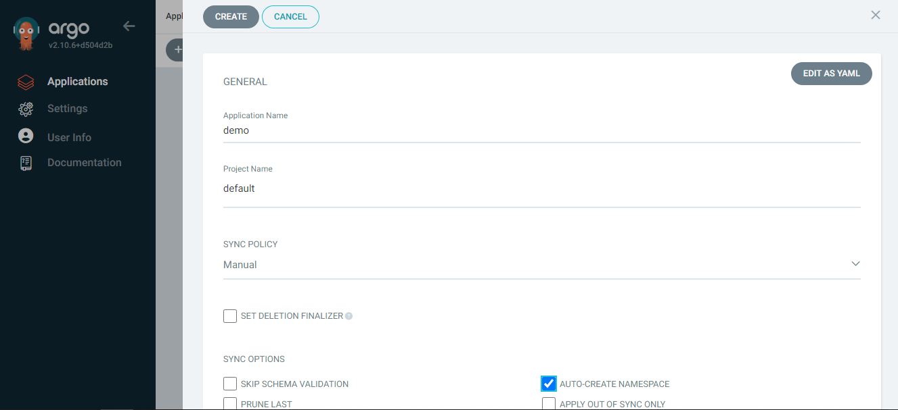
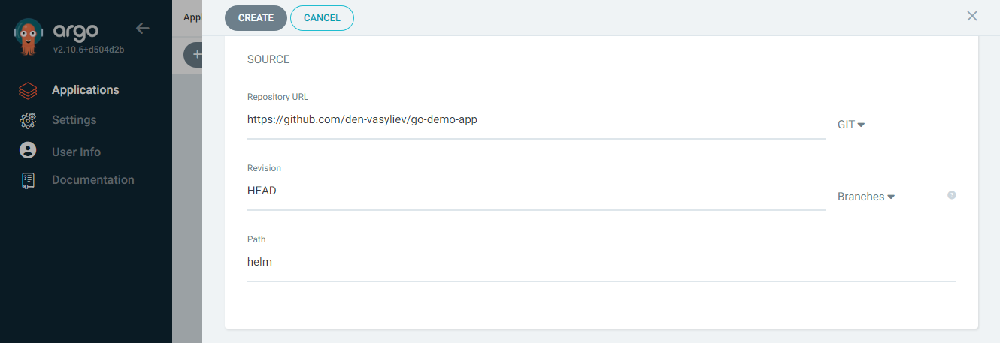
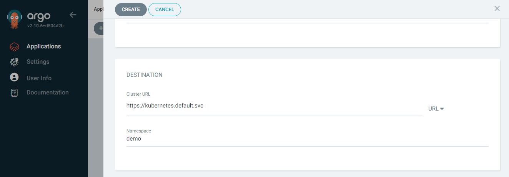
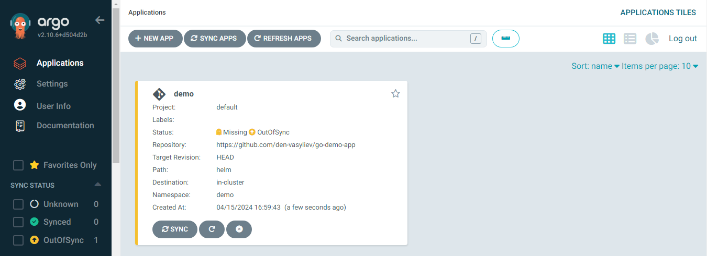
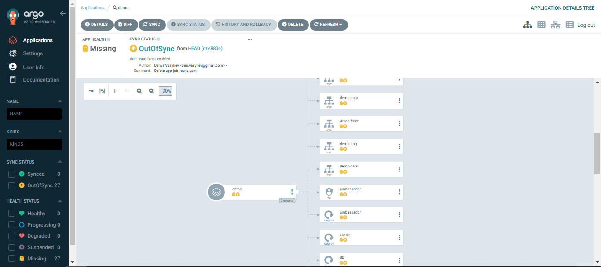
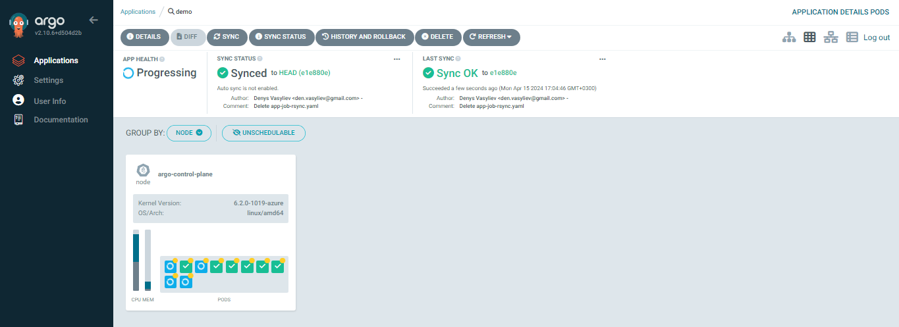
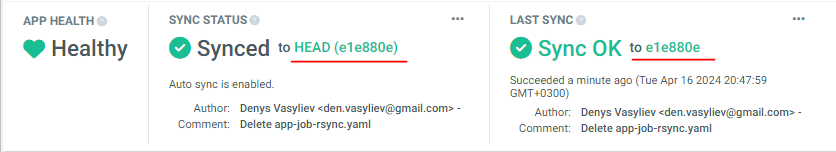
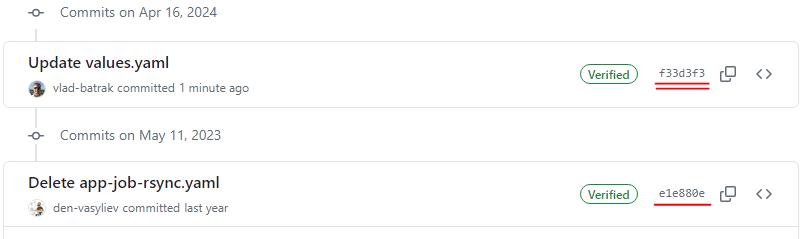
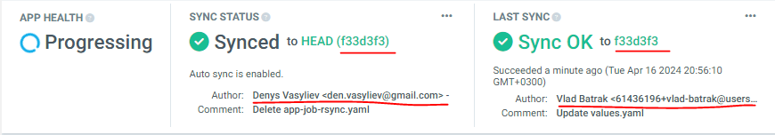

# Minimum viable product (MVP)

## Automate deployment of Ambassador application by the Argo CD service

1. Setting up the CD conveyor in Argo CD

2. Result

3. Synchronization with the repository

4. Let's create a fork of the original repository and change the application settings of the **REPO URL** and **AUTO SYNC POLICY** is **"Enabled"**.

5. Сhange the file /helm/values.yaml in the repository and make a commit

6. After 3 minutes, Argo CD will compare the git-repository with the application configuration and begin auto synchronization

### Demo

Gif-demo

or asciicast

