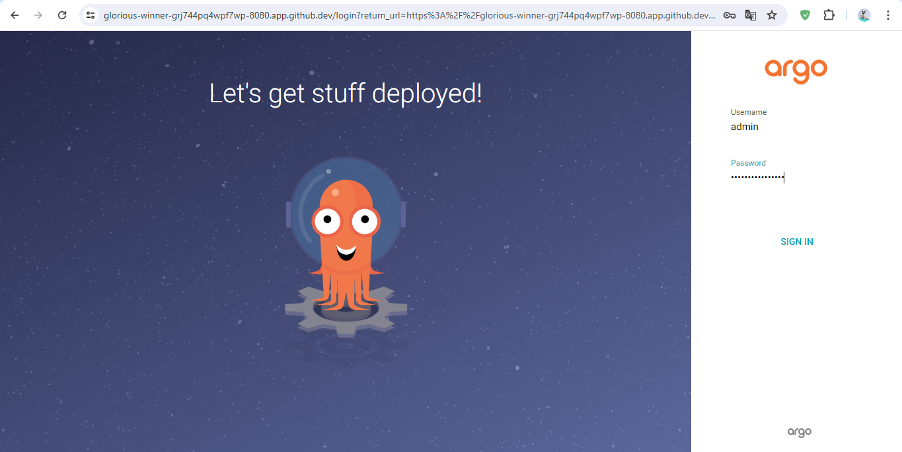

# Proof of Concept (PoC)

## Deploying an Argo CD application in Kubernetes from scratch

### Workbook

1. Install KIND and create an argo cluster:
    ```bash
    go install sigs.k8s.io/kind@v0.22.0
    kind create cluster --name argo
    ```

2. Install ArgoCD into the cluster:
    - Create a namespace for ArgoCD:
    ```bash
    kubectl create namespace argocd
    ```
    - Apply the installation script:
    ```bash
    kubectl apply -n argocd -f https://raw.githubusercontent.com/argoproj/argo-cd/stable/manifests/install.yaml
    ```

3. Check the status of the installation:
    ```bash
    kubectl get all -A
    ```

4. Status of the claster pods:
    ```bash
    kubectl get pod -n argocd -w
    ```

5. Access the ArgoCD GUI:
    - Port Forwarding: Use local port 8080 to forward to the ArgoCD server service in the argocd namespace:
    ```bash
    kubectl port-forward svc/argocd-server -n argocd 8080:443
    ```
    > ArgoCD uses HTTPS, so accessing `127.0.0.1:8080` may result in a certificate error. In a production system, certificates should be installed and configured accordingly.
    
    - Obtain the initial admin password:
    ```bash
    $ kubectl -n argocd get secret argocd-initial-admin-secret -o jsonpath="{.data.password}"|base64 -d;echo
    ```
    - Enter the obtained password and login as admin into the ArgoCD Web interface.
    

### Demo

Gif-demo


або asciicast

[](https://asciinema.org/a/xtz7jt7yTGFeaZ2IerCcCVGMq)
